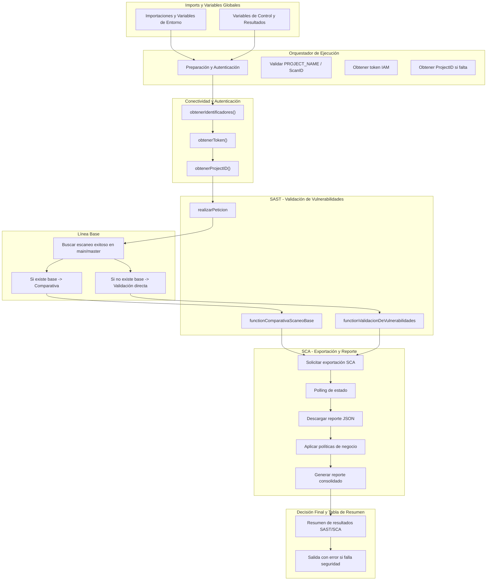

```mermaid
flowchart TD
    subgraph GLOBAL[Imports y Variables Globales]
        A[Importaciones y Variables de Entorno]
        B[Variables de Control y Resultados]
    end

    subgraph ORQ[Orquestador de Ejecución]
        C[Preparación y Autenticación]
        D[Validar PROJECT_NAME / ScanID]
        E[Obtener token IAM]
        F[Obtener ProjectID si falta]
    end

    subgraph AUTH[Conectividad y Autenticación]
        G["obtenerIdentificadores()"]
        H["obtenerToken()"]
        I["obtenerProjectID()"]
    end

    subgraph SAST[SAST - Validación de Vulnerabilidades]
        J[realizarPeticion]
        K[functionComparativaScaneoBase]
        L[functionValidacionDeVulnerabilidades]
    end

    subgraph BASE[Línea Base]
        M[Buscar escaneo exitoso en main/master]
        N[Si existe base -> Comparativa]
        O[Si no existe base -> Validación directa]
    end

    subgraph SCA[SCA - Exportación y Reporte]
        P[Solicitar exportación SCA]
        Q[Polling de estado]
        R[Descargar reporte JSON]
        S[Aplicar políticas de negocio]
        T[Generar reporte consolidado]
    end

    subgraph FINAL[Decisión Final y Tabla de Resumen]
        U[Resumen de resultados SAST/SCA]
        V[Salida con error si falla seguridad]
    end

    A --> C
    B --> C
    C --> G
    G --> H
    H --> I
    I --> J
    J --> M
    M --> N
    M --> O
    N --> K
    O --> L
    K --> P
    L --> P
    P --> Q
    Q --> R
    R --> S
    S --> T
    T --> U
    U --> V
```